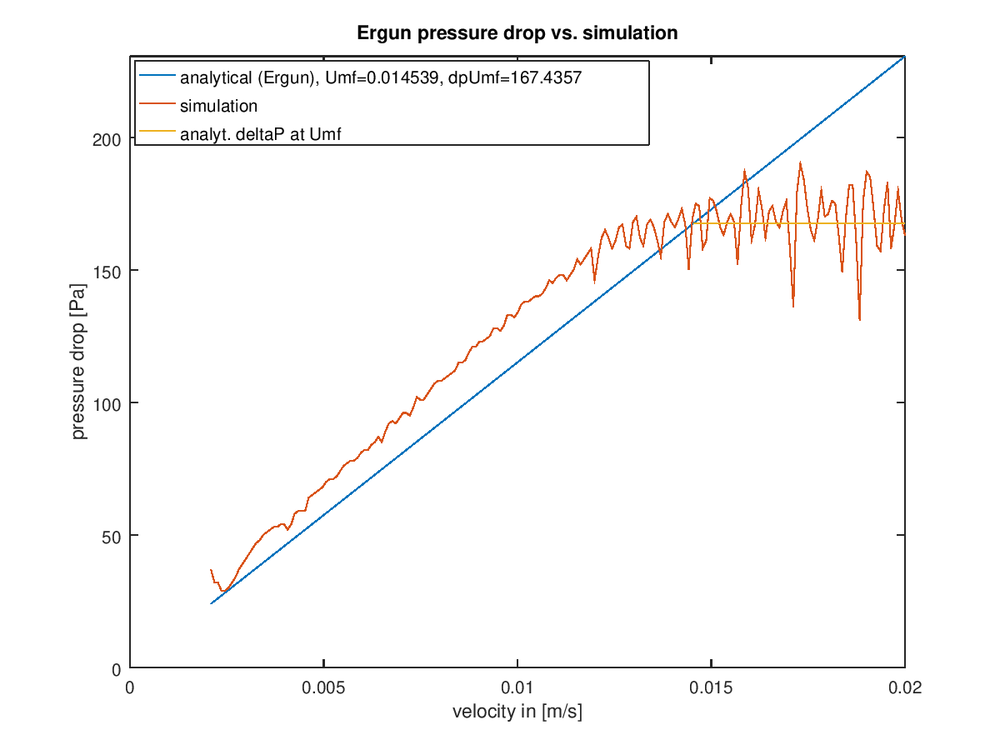
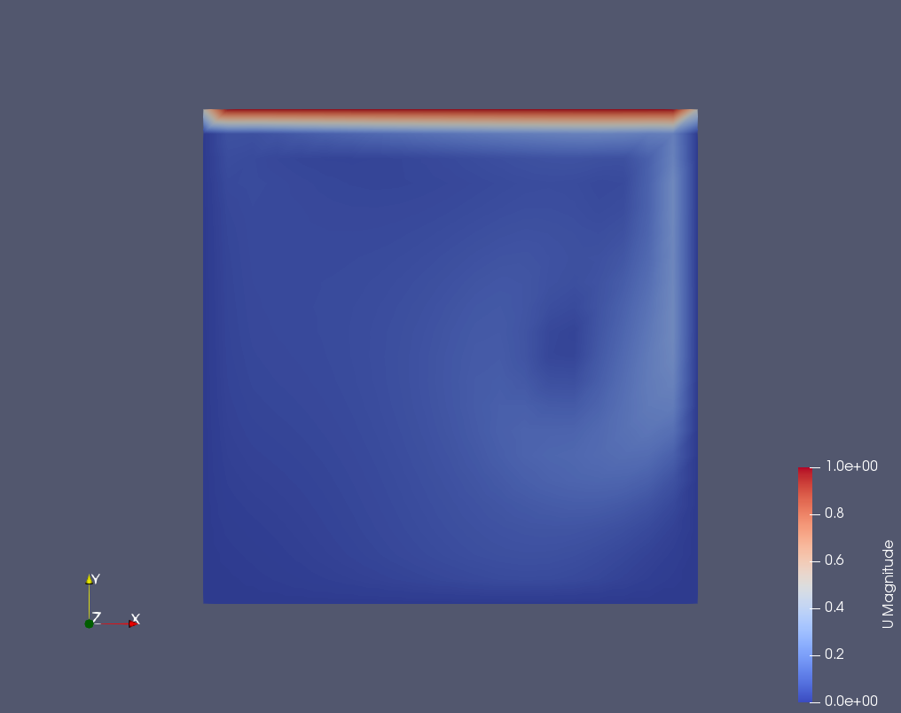
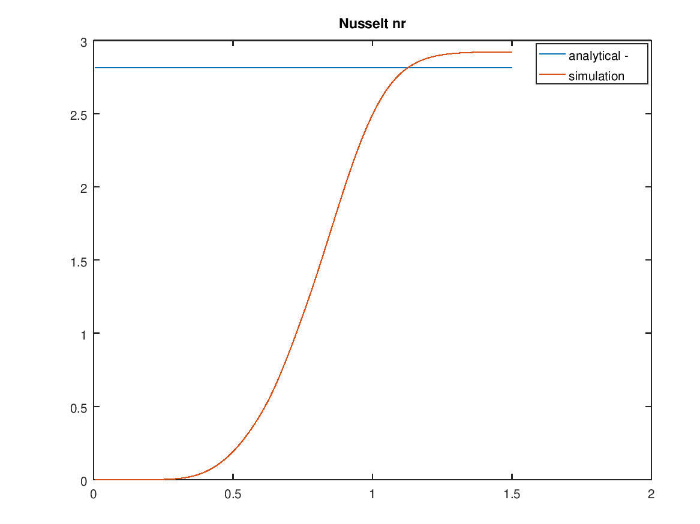

# CFDEM-rhoCfdemSolverPimple

Solver name: rhoCfdemSolverPimple
Compressible, Isothermal, CFDEM coupled solver, with PIMPLE algorithm

Testing Status
- Reproduces incompressible cfdemSolverPiso ErgunMPI tutorial, with constant properties (that is, incompressible, with particles)
- Reproduces rhoPimpleFoam tutorials (e.g., cavity, pitzDaly, sqBendLiq) without particles (that is, compressible, without particles)

**Currently we do not have a benchmark for compressible, with particles**

# CFDEM-rhoCfdemSolverPimpleScalar

Solver name: rhoCfdemSolverPimpleScalar
Compressible, Isothermal, CFDEM coupled solver, with PIMPLE algorithm and scalar transport

**Note: A compressible radiation model has not been developed. Radiation is not enabled with rhoCfdemSolverPimpleScalar!**

# Prerequisites
- CFDEM 3.8.0
- LIGGGHTS 3.8.0

# Basis
- rhoCfdemSolverPimple: Combines cfdemSolverPiso with rhoPimpleFoam
- rhoCfdemSolverPimpleScalar: Combines CfdemSovlerPisoScalar with rhoPimpleFoam

# Installation
- Place the contents of the solver directory in `$CFDEM_SOLVER_DIR`
- Ensure the [compressible CFDEM library](https://github.com/TonkomoLLC/CFDEM_compressible/tree/master/CFDEM-Compressible_Lagrangian_Library) is installed.
- Within the rhoCfdemSolverPimple directory, type `wclean` then `wmake`
- Place the contents of the tutorial directory in `$CFDEM_TUT_DIR`
- Optionally, add `rhoCfdemSolverPimple/dir` to the last line of solver-list.txt, located in `$CFDEM_SRC_DIR/lagrangian/cfdemParticle/etc`.
If this edit is made, then rhoCfdemSolverPimple will automatically compile with the `cfdemCompCFDEMsol` command
- Within the rhoCfdemSolverPimpleScalar directory, type `wclean` then `wmake`
- Place the contents of the tutorial directory in `$CFDEM_TUT_DIR`
- Optionally, add `rhoCfdemSolverPimpleScalar/dir` to the last line of solver-list.txt, located in `$CFDEM_SRC_DIR/lagrangian/cfdemParticle/etc`.
If this edit is made, then rhoCfdemSolverPimpleScalar will automatically compile with the `cfdemCompCFDEMsol` command


# Programming and Tutorial Notes
- These solvers have ONLY been tested with OpenFOAM 5.x
- The units for 0/p in the CFDEM ErgunMPI & packedBedTemp tutorials are changed relative to cfdemSolverPiso/cfdemSolverPisoScalar:
Because the new solvers are incompressible, the units for pressure is now in Pa
- LIGGGHTS coupling can be enabled or disabled with the "switch" found in `caseDir/system/couplingParameters`. An example is found in the ErgunMPI test case included here. To run standard OpenFOAM tutorials, LIGGGHTS coupling must be disabled, as described below.

# system/couplingParameters
To use the solver in rhoPimpleFoam (no particles) format, use the following setting in `caseDir/system/couplingParameters`

```
enableCoupling          off;
```

To use the solver in CFDEM mode (particles), use the following setting in `caseDir/system/couplingParameters`

```
enableCoupling          on;
```

# Testing rhoCfdemSolverPimple
## Example #1: Constant properties (i.e., constant rho => incompressible), with particles
- CFDEM Tutorial ErgunMPI returns a similar result to cfdemSolverPiso. See `tutorials/rhoCfdemSolverPimple/ErgunMPI`.



## Example #2: Compressible, no particles
- OpenFOAM tutorial rhoPimpleFoam/cavity can be reproduced with rhoCfdemSolverPimple.  See `tutorials/rhoCdemSolverPimple/cavity` tutorial.



## Example #3: Compressible, no particles
- OpenFOAM tutorial rhoPimpleFoam/pitzDaly can be reproduced with rhoCfdemSolverPimple.  See `tutorials/rhoCdemSolverPimple/pitzDaly` tutorial.
- Left video - rhoCfdemSolverPimple (but LIGGGHTS coupling is disabled)
- Right video - OpenFOAM 5.x rhoPimpleFoam


## Example #4: Compressible, no particles
- OpenFOAM tutorial rhoPimpleFoam/sqBendLiq can be reproduced with rhoCfdemSolverPimple.  See `tutorials/rhoCdemSolverPimple/sqBendLiq` tutorial.


## Example #5: SettlingTestMPI
- CFDEM tutorial settlingTestMPI returns a similar result to cfdemSolverPiso.  See `tutorials/rhoCfdemSolverPimple/settlingTestMPI`.


# Testing rhoCfdemSolverPimpleScalar
- CFDEM Tutorial packedBed returns a similar result to cfdemSolverPiso. See `tutorials/rhoCfdemSolverPimpleScalar/packedBedTemp`.
- Results




# Notes for converting an incompressible tutorial from CFDEM to a compressible tutorial

1. Some basic changes are needed:

- Convert 0/p from incompressible units to compressible units, and adjust for the difference between gauge and absolute pressure. For example, 0 pressure in an incompressible tutorial is ~1E5 Pa in a compressible tutorial.

- Add a file for temperature in 0/T.

- Create a file for rho and adjust to the value of rho in the incompressible tutorial. Often this is found in the octave file for post processing. For an incompressible tutorial, pressure = p/rho and viscosity is kinematic viscosity (mu/rho), so the value of rho must be found from the post processing of an incompressible case.

- Add a couplingProperties file to the system directory.  This allows OpenFOAM tutorials, without any CFDEM interaction, to run in the event system/couplingParameters `enableCoupling` is set to `off`

- In the constant directory, `transportProperties` is replaced by `thermophysicalProperties`.  Be sure to set rho and mu accordingly. Often rho can be found in the octave file in an incompressible CFDEM tutorial.  Meanwhile, viscosity, mu, is equal to nu * rho, where nu is the kinematic viscosity in the incompressible case.


